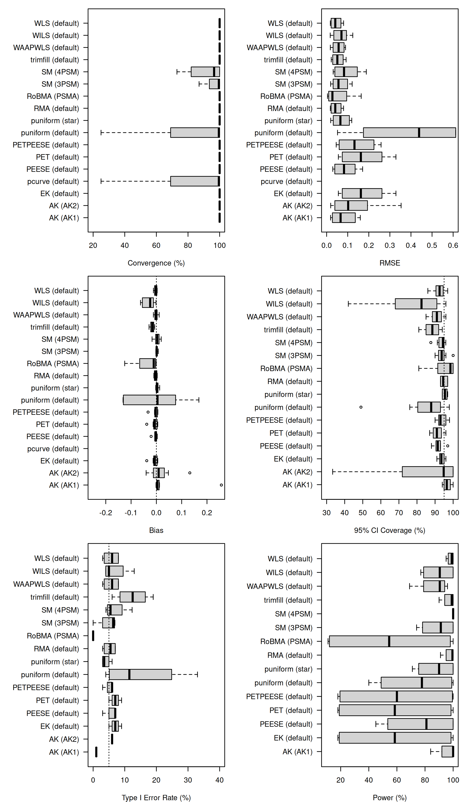

README
================

<!-- README.md is generated from README.Rmd. Please edit that file -->

# PublicationBiasBenchmark

An R package for benchmarking publication bias correction methods
through simulation studies.

## Installation

``` r
# Install from GitHub
devtools::install_github("FBartos/PublicationBiasBenchmark")
```

## Usage

``` r
library(PublicationBiasBenchmark)
#> 
#> Attaching package: 'PublicationBiasBenchmark'
#> The following object is masked from 'package:stats':
#> 
#>     power
```

### Simulating From Existing Data Generating Models

``` r

# Obtain a data.frame with pre-defined conditions
dgm_conditions("Stanley2017")

# simulate the data from the second condition
df <- simulate_dgm("Stanley2017", 2)

# fit a method
run_method("RMA", df)
```

### Use Pre-Simulated Datasets

``` r

# download the pre-simulated datasets to "sims" folder
download_folder <- file.path(getwd(), "sims")
download_dgm_datasets("no_bias", path = download_folder)

# retrieve first repetition of first condition from the downloaded datasets
retrieve_dgm_dataset("no_bias", condition_id = 1, repetition_id = 1, path = download_folder)
```

### Use Pre-Computed Results

``` r

# download the pre-computed results to "res" folder
download_folder <- file.path(getwd(), "res")
download_dgm_results("no_bias", path = download_folder)

# retrieve results the first repetition of first condition of RMA from the downloaded results
retrieve_dgm_results("no_bias", method = "RMA", condition_id = 1, repetition_id = 1, path = download_folder)

# retrieve all results across all conditions and repetitions
retrieve_dgm_results("no_bias", path = download_folder)
```

### Use Pre-Computed Metrics

``` r

# download the pre-computed results to "res" folder
download_folder <- file.path(getwd(), "res")
download_dgm_metrics("no_bias", path = download_folder)

# retrieve metrics of bias the first condition of RMA from the downloaded results
retrieve_dgm_metrics("no_bias", metric = "bias", method = "RMA", condition_id = 1, path = download_folder)

# retrieve all metrics across all conditions and metrics
retrieve_dgm_metrics("no_bias", path = download_folder)
```

### Visualize Precomputed Results

``` r
# retrieve all metrics across all conditions and metrics
download_folder <- file.path(getwd(), "res")
df <- retrieve_dgm_metrics("no_bias", path = download_folder)

# retrieve conditions
conditions <- dgm_conditions("no_bias")

# add labels
df$label <- with(df, paste0(method, " (", method_setting, ")"))

# distinquish between H0 and H1
df$H0 <- df$condition_id %in% conditions$condition_id[conditions$mean_effect == 0]

par(mfrow = c(3, 2))

par(mar = c(4, 10, 1, 1))
boxplot(convergence ~ label, horizontal = T, las = 1, ylab = "", ylim = c(0.5, 1), data = df, xlab = "Convergence")
boxplot(rmse ~ label, horizontal = T, las = 1, ylab = "", ylim = c(0, 0.25), data = df, xlab = "RMSE")
boxplot(bias ~ label, horizontal = T, las = 1, ylab = "", ylim = c(-0.25, 0.25), data = df, xlab = "Bias")
abline(v = 0, lty = 3)
boxplot(coverage ~ label, horizontal = T, las = 1, ylab = "", ylim = c(0.5, 1), data = df, xlab = "CI Coverage")
abline(v = 0.95, lty = 3)
boxplot(power ~ label, horizontal = T, las = 1, ylab = "", ylim = c(0, 0.5), data = df[df$H0,], xlab = "Type I Error")
abline(v = 0.05, lty = 3)
boxplot(power ~ label, horizontal = T, las = 1, ylab = "", ylim = c(0.5, 1), data = df[!df$H0,], xlab = "Power")
```



### Simulating From Existing DGM With Custom Settings

``` r

# define sim setting
sim_settings <- list(
  n_studies     = 100,
  mean_effect   = 0.3,
  heterogeneity = 0.1
)

# check whether it is feasible
# (defined outside of the function - not to decrease performance during simulation)
validate_dgm_setting("no_bias", sim_settings)

# simulate the data
df <- simulate_dgm("no_bias", sim_settings)

# fit a method
run_method("RMA", df)
```

### Key Functions

#### Data Generating Mechanisms

- `simulate_dgm()`: Generates simulated data according to specified data
  generating model and settings.
- `dgm_conditions()`: Lists prespecified conditions of the data
  generating mechanism.
- `validate_dgm_setting()`: Validates (custom) setting of the data
  generating mechanism.
- `download_dgm_datasets()`: Downloads pre-simulated datasets from the
  OSF repository.
- `retrieve_dgm_dataset()`: Retrieves the pre-simulated dataset of a
  given condition and repetition from downloaded from the pre-downloaded
  OSF repository.

#### Method Estimation And Results

- `run_method()`: Estimates method on a supplied data according to the
  specified settings.
- `method_settings()`: Lists prespecified settings of the method.
- `download_dgm_results()`: Downloads pre-computed results from the OSF
  repository.
- `retrieve_dgm_results()`: Retrieves the pre-computed results of a
  given method, condition, and repetition from the pre-downloaded OSF
  repository.

#### Performance Metrics And Results

- `bias()`, `bias_mcse()`, etc.: Functions to compute performance
  metrics and their Monte Carlo standard errors.
- `download_dgm_metrics()`: Downloads pre-computed performance metrics
  from the OSF repository.
- `retrieve_dgm_metrics()`: Retrieves the pre-computed performance
  metrics of a given method, condition, and repetition from the
  pre-downloaded OSF repository.

### Available DGM Models

See `methods("dgm")` for the full list:

- `"no_bias"`: Generates data without publication bias (a test
  simulation)
- `"Stanley2017"`: Stanley et al. (2017)
- `"Alinaghi2018"`: Alinaghi & Reed (2018)
- `"Bom2019"`: Bom & Rachinger (2019)
- `"Carter2019"`: Carter et al. (2019)

### Available Methods

See `methods("method")` for the full list:

- `"RMA"`: Random effects meta-analysis
- `"PET"`: Precision-Effect Test (PET) publication bias adjustment
  (Stanley & Doucouliagos, 2014)
- `"PEESE"`: Precision-Effect Estimate with Standard Errors (PEESE)
  publication bias adjustment (Stanley & Doucouliagos, 2014)
- `"PETPEESE"`: Precision-Effect Test and Precision-Effect Estimate with
  Standard Errors (PET-PEESE) publication bias adjustment (Stanley &
  Doucouliagos, 2014)
- …

### Available Performance Metrics

See `?performance_metrics` for the full list of performance metrics and
their Monte Carlo standard errors/

### DGM OSF Repositories

All DGM are linked within the OSF repository () and contain the
following elements:

- `data` : folder containing by-condition simulated datasets for all
  repetitions
- `results` : folder containing by-method results for all conditions \*
  repetitions
- `metrics` : folder containing by-metric performance for all methods \*
  conditions
- `metadata` : folder containing the following information:
  - `dgm-conditions.csv` : file mapping of all conditions and the
    corresponding settings
  - `dgm-generation.R` : file with code for exact reproduction of the
    pre-simulated datasets
  - `dgm-sessionInfo.txt`: file with reproducibility details for the
    pre-simulated datasets
  - `results.R` : file with code for exact reproduction of the by method
    results (might be method / method groups specific)
  - `results-sessionInfo.txt`: file with reproducibility details for the
    precomputed results (might be method / method groups specific)
  - `performance_metrics.R` : file with code for computation of
    performance metrics

### References

<div id="refs" class="references csl-bib-body hanging-indent"
entry-spacing="0" line-spacing="2">

<div id="ref-alinaghi2018meta" class="csl-entry">

Alinaghi, N., & Reed, W. R. (2018). Meta-analysis and publication bias:
How well does the FAT-PET-PEESE procedure work? *Research Synthesis
Methods*, *9*(2), 285–311. <https://doi.org/10.1002/jrsm.1298>

</div>

<div id="ref-bom2019kinked" class="csl-entry">

Bom, P. R., & Rachinger, H. (2019). A kinked meta-regression model for
publication bias correction. *Research Synthesis Methods*, *10*(4),
497–514. <https://doi.org/10.1002/jrsm.1352>

</div>

<div id="ref-carter2019correcting" class="csl-entry">

Carter, E. C., Schönbrodt, F. D., Gervais, W. M., & Hilgard, J. (2019).
Correcting for bias in psychology: A comparison of meta-analytic
methods. *Advances in Methods and Practices in Psychological Science*,
*2*(2), 115–144. <https://doi.org/10.1177/2515245919847196>

</div>

<div id="ref-stanley2014meta" class="csl-entry">

Stanley, T. D., & Doucouliagos, H. (2014). Meta-regression
approximations to reduce publication selection bias. *Research Synthesis
Methods*, *5*(1), 60–78. <https://doi.org/10.1002/jrsm.1095>

</div>

<div id="ref-stanley2017finding" class="csl-entry">

Stanley, T. D., Doucouliagos, H., & Ioannidis, J. P. (2017). Finding the
power to reduce publication bias. *Statistics in Medicine*, *36*(10),
1580–1598. <https://doi.org/10.1002/sim.7228>

</div>

</div>
